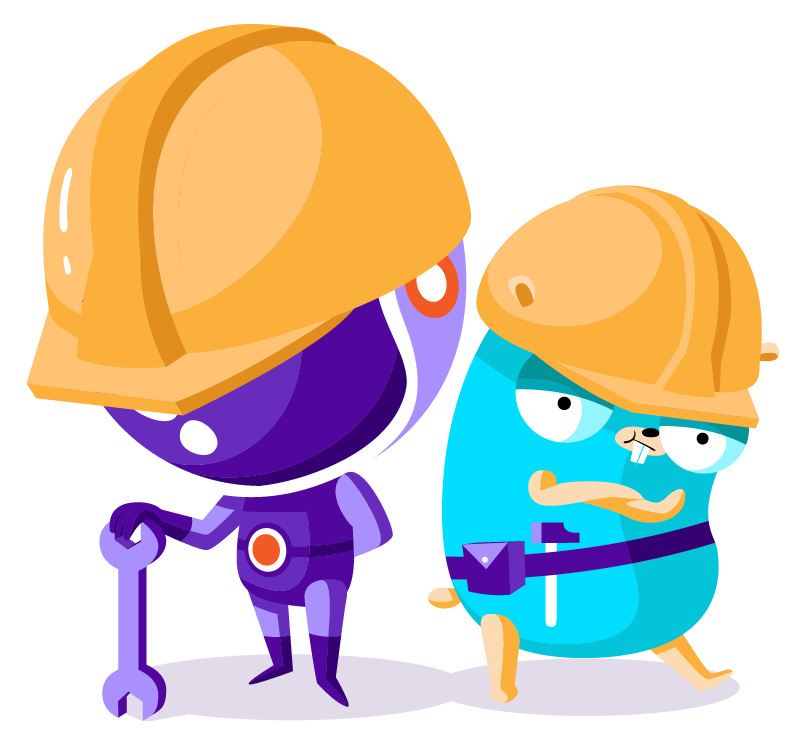

# Contribute to `scaleway-sdk-go`

`scaleway-sdk-go` is Apache 2.0 licensed and accepts contributions via GitHub.
This document will cover how to contribute to the project and report issues.

## Topics

- [Reporting Security Issues](#reporting-security-issues)
- [Reporting Issues](#reporting-issues)
- [Suggesting feature](#suggesting-feature)
- [Contributing Code](#contributing-code)
- [Community Guidelines](#community-guidelines)

## Reporting security issues

At Scaleway we take security seriously.
If you have any issue regarding security, please notify us by sending an email to [security@scaleway.com](mailto:security@scaleway.com).

Please _DO NOT_ create a GitHub issue.

We will follow up with you promptly with more information and a plan for remediation.
We currently do not offer a paid security bounty program, but we would love to send some Scaleway swag your way along with our deepest gratitude for your assistance in making Scaleway a more secure Cloud ecosystem.

## Reporting issues

A great way to contribute to the project is to send a detailed report when you encounter a bug.
We always appreciate a well-written, thorough bug report, and will thank you for it!
Before opening a new issue, we appreciate you reviewing open issues to see if there are any similar requests.
If there is a match, thumbs up the issue with a 👍 and leave a comment if you have additional information.

When reporting an issue, include the following:

- The version of `scaleway-sdk-go` you are using (v2.0.0-beta1, v2.0.0, master,...)
- Go version
- GOOS
- GOARCH

## Suggesting a feature

When requesting a feature, some of the questions we want to answer are:

- What value does this feature bring to end users?
- How urgent is the need (nice to have feature or need to have)?
- Does this align with the goals of `scaleway-sdk-go`?

## Contributing code

Before contributing to the code, make sure you have read about the [continuous code deployment](docs/CONTINUOUS_CODE_DEPLOYMENT.md) process we are using on this repo.

### Submit code

To submit code:

- Create a fork of the project
- Create a topic branch from where you want to base your work (usually master)
- Add tests to cover contributed code
- Push your commit(s) to your topic branch on your fork
- Open a pull request against `scaleway-sdk-go` master branch that follows [PR guidelines](#pull-request-guidelines)

The [maintainers](MAINTAINERS.md) of `scaleway-sdk-go` use a "Let's Get This Merged" (LGTM) message in the pull request to note that the commits are ready to merge.
After one or more maintainer states LGTM, we will merge.
If you have questions or comments on your code, feel free to correct these in your branch through new commits.

### Pull Request Guidelines

The goal of the following guidelines is to have Pull Requests (PRs) that are fairly easy to review and comprehend, and code that is easy to maintain in the future.

- **Pull Request title should be clear** on what is being fixed or added to the code base.
  If you are addressing an open issue, please start the title with "fix: #XXX" or "feature: #XXX"
- **Keep it readable for human reviewers** and prefer a subset of functionality (code) with tests and documentation over delivering them separately
- **Don't forget commenting code** to help reviewers understand and to keep [our Go Report Card](https://goreportcard.com/report/github.com/scaleway/scaleway-sdk-go) at A+
- **Notify Work In Progress PRs** by prefixing the title with `[WIP]`
- **Please, keep us updated.**
  We will try our best to merge your PR, but please notice that PRs may be closed after 30 days of inactivity.

Your pull request should be rebased against the current master branch. Please do not merge
the current master branch in with your topic branch, nor use the Update Branch button provided
by GitHub on the pull request page.

Keep in mind only the **Pull Request Title** will be used as commit message as we stash all commits on merge.

## Community guidelines

See [CODE_OF_CONDUCT.md](CODE_OF_CONDUCT.md).

Thank you for reading through all of this, if you have any question feel free to [reach us](README.md#reach-us)!

## Developer documentation

### Namespaces

Namespaces SHOULD only be written using lowercase letters. No dash are allowed.

Example: `accountprivate` is a valid Go namespace.

### Validation

Some validation is done internally on Scaleway's side: see [scaleway-sdk-go/docs/CONTINUOUS_CODE_DEPLOYMENT.md](https://github.com/scaleway/scaleway-sdk-go/blob/master/docs/CONTINUOUS_CODE_DEPLOYMENT.md)
This is true for:
- package namespaces.

The rest is manually checked for now.
