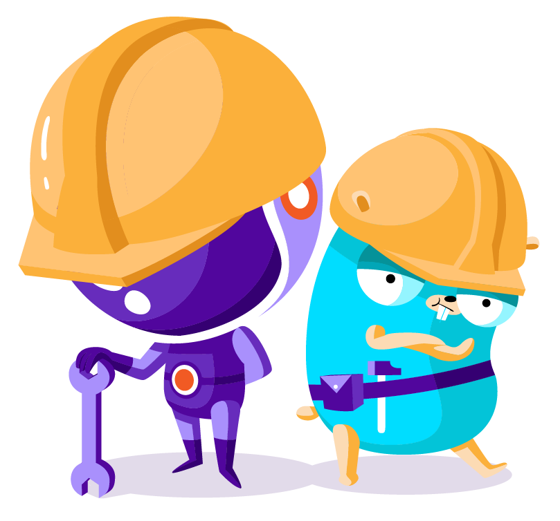

<p align="center"></p>

<p align="center">
  <a href="https://pkg.go.dev/github.com/scaleway/scaleway-sdk-go?tab=doc"></a>
  <a href="https://github.com/scaleway/scaleway-sdk-go/actions?query=workflow%3Apull-request"></a>
  <a href="https://goreportcard.com/report/github.com/scaleway/scaleway-sdk-go"></a>
</p>

# Scaleway GO SDK

**:warning: This is an early release, keep in mind that the API can break**

Scaleway is a single way to create, deploy and scale your infrastructure in the cloud. We help thousands of businesses to run their infrastructures easily.

## Documentation

- [Godoc](https://pkg.go.dev/github.com/scaleway/scaleway-sdk-go?tab=doc)
- [Developers website](https://developers.scaleway.com) (API documentation)

## Installation

```bash
go get github.com/scaleway/scaleway-sdk-go
```

## Getting Started

```go
package main

import (
	"fmt"

	"github.com/scaleway/scaleway-sdk-go/api/instance/v1"
	"github.com/scaleway/scaleway-sdk-go/scw"
	"github.com/scaleway/scaleway-sdk-go/utils"
)

func main() {

	// Create a Scaleway client
	client, err := scw.NewClient(
		// Get your credentials at https://console.scaleway.com/project/credentials
		scw.WithDefaultOrganizationID("ORGANISATION_ID"),
		scw.WithAuth("ACCESS_KEY", "SECRET_KEY"),
	)
	if err != nil {
		panic(err)
	}

	// Create SDK objects for Scaleway Instance product
	instanceApi := instance.NewAPI(client)

	// Call the ListServers method on the Instance SDK
	response, err := instanceApi.ListServers(&instance.ListServersRequest{
		Zone: scw.ZoneFrPar1,
	})
	if err != nil {
		panic(err)
	}

	// Do something with the response...
	for _, server := range response.Servers {
		fmt.Println("Server", server.ID, server.Name)
	}

}
```

## Examples

You can find additional examples in the [GoDoc](https://pkg.go.dev/github.com/scaleway/scaleway-sdk-go?tab=doc).

## Development

This repository is at its early stage and is still in active development.
If you are looking for a way to contribute please read [CONTRIBUTING.md](CONTRIBUTING.md).

## Reach us

We love feedback.
Feel free to reach us on [Scaleway Slack community](https://slack.scaleway.com/), we are waiting for you on [#opensource](https://scaleway-community.slack.com/app_redirect?channel=opensource).
